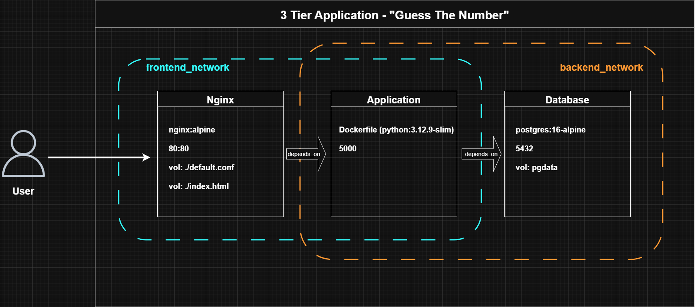

# 🎯 Guess The Number — 3-Tier Application

A number guessing game where players try to guess a secret number between 1-1000.
Each guess is ranked by distance from the secret number and shown on a leaderboard.
Built with Flask, PostgreSQL, and Nginx.

## Architecture Diagram


## How This Fits in the Project
 
This is **one of three repositories** that make up the complete infrastructure:
 
| Repository | Purpose | Technology |
|------------|---------|------------|
| **[GTNGame_infra-repo](https://github.com/guylaiter/GTNGame_infra-repo)** | AWS infrastructure provisioning | Terraform, EKS, VPC, ArgoCD |
| **[GTNGame_app-repo](https://github.com/guylaiter/GTNGame_app-repo)** ← You are here | Application source code & CI/CD | Flask, PostgreSQL, GitHub Actions |
| **[GTNGame_cluster-repo](https://github.com/guylaiter/GTNGame_cluster-repo)** | Kubernetes manifests & GitOps | Helm, ArgoCD, K8s |

## Overview

### Application Architecture
```
[Browser] → [Nginx :80] → [Flask :5000] → [PostgreSQL :5432]
```

- **Tier 1 (Frontend):** Nginx serving static HTML/CSS/JS
- **Tier 2 (Backend):** Flask REST API
- **Tier 3 (Database):** PostgreSQL

### Networks (Docker Compose)
- `backend_network` — db + backend (backend talks to db)
- `frontend_network` — backend + frontend (nginx proxies to backend)

### Anti-Cheat Features
- One guess per name (case-sensitive)
- One guess per IP address
- Both checks enforced at the database level

## Prerequisites

### For Local Development (Docker Compose)
- Docker
- Docker Compose

### For Production Deployment (Kubernetes)
- EKS cluster running (see infrastructure-repo)
- ArgoCD configured (see infrastructure-repo)
- AWS ECR repository created
- GitHub Actions secrets configured:
  - `AWS_ROLE_ARN`
  - `AWS_REGION`
  - `AWS_ECR_REPOSITORY`

## Quick Setup

### Local Development

#### 1. Create a `.env` file in the project root
```bash
SECRET_NUMBER=42
POSTGRES_USER=postgres
POSTGRES_PASSWORD=postgres
POSTGRES_DB=guessdb
DATABASE_URL=postgresql://postgres:postgres@db:5432/guessdb
```

#### 2. Start the app
```bash
docker-compose up --build
```

#### 3. Open your browser
```
http://localhost
```

#### 4. Stop the app
```bash
docker-compose down
# To also remove the database volume:
docker-compose down -v
```

### Production Deployment

Production deployment is automated via GitHub Actions CI/CD:

1. **Push code to GitHub** (main, dev, or staging branch)
2. **GitHub Actions runs:**
   - Unit tests
   - Integration tests
   - Docker build
   - Push to ECR with versioned tag
3. **ArgoCD** automatically deploys to Kubernetes (when cluster-repo is configured)

See [cluster-repo](https://github.com/guylaiter/FinalProject_cluster-repo) for Kubernetes deployment configuration.

## API Endpoints

| Method | Endpoint | Description |
|--------|----------|-------------|
| POST | `/api/guess` | Submit a guess |
| GET | `/api/guess/me` | Get your own guess by IP |
| GET | `/api/guess/<name>` | Get a specific guess by name |
| DELETE | `/api/guess` | Delete your guess (by IP) |
| GET | `/api/leaderboard` | Get top 20 guesses |
| GET | `/api/health` | Health check endpoint |

### POST /api/guess
**Body:**
```json
{ "name": "Alice", "guess": 75 }
```
**Response:**
```json
{
  "name": "Alice",
  "guess": 75,
  "distance": 33,
  "percentile": 82,
  "message": "You were 33 away from the target!"
}
```

### GET /api/guess/me
Returns the guess associated with the requester's IP address.

**Response (exists):**
```json
{ "exists": true, "name": "Alice", "guess": 75, "distance": 33 }
```
**Response (not found):**
```json
{ "exists": false }
```

### GET /api/guess/\<name\>
**Response:**
```json
{
  "name": "Alice",
  "guess": 75,
  "distance": 33,
  "created_at": "2024-01-01 12:00"
}
```

### DELETE /api/guess
Deletes the guess associated with the requester's IP address.

**Response:**
```json
{ "message": "Guess by 'Alice' deleted successfully" }
```

### GET /api/leaderboard
**Response:**
```json
[
  {
    "rank": 1,
    "name": "Bob",
    "guess": 43,
    "distance": 1,
    "created_at": "2024-01-01 12:30"
  },
  {
    "rank": 2,
    "name": "Alice",
    "guess": 75,
    "distance": 33,
    "created_at": "2024-01-01 12:00"
  }
]
```

## Repository Structure

```
.
├── .github/
│   ├── scripts/
│   │   └── determine-version.sh    # Semantic versioning script
│   └── workflows/
│       ├── ci.yaml                 # CI/CD pipeline
│       │                           # - Run tests
│       │                           # - Build Docker image
│       │                           # - Push to ECR
│       │                           # - Version tagging
│       └── e2e.yaml                # End-to-end tests
│
├── backend/
│   ├── app.py                      # Flask application
│   │                               # - REST API endpoints
│   │                               # - Database models
│   │                               # - Business logic
│   ├── Dockerfile                  # Container image definition
│   ├── requirements.txt            # Python dependencies
│   └── tests/
│       ├── app_tests/              # Unit tests
│       │   └── test_app.py
│       └── e2e_tests/              # End-to-end tests
│           └── test_api_e2e.py
│
├── frontend/
│   └── index.html                  # Single-page application
│                                   # - Game UI
│                                   # - Leaderboard display
│                                   # - API integration
│
├── nginx/
│   └── default.conf                # Nginx configuration
│                                   # - Reverse proxy to Flask
│                                   # - Static file serving
│
├── docker-compose.yml              # Local development stack
├── .dockerignore                   # Docker build exclusions
├── .gitignore                      # Git exclusions
└── README.md                       # This file
```

## CI/CD Pipeline
 
### Workflow
 


### Branch Strategy
- **main:** Production deployments → `GTNGame_app-repomain`
- **staging:** Staging deployments → `GTNGame_app-repostaging`
- **dev:** Development deployments → `GTNGame_app-repodev`

### Versioning
Automatic semantic versioning based on commit messages:
- `feat:` → Minor version bump (1.0.0 → 1.1.0)
- `fix:` → Patch version bump (1.0.0 → 1.0.1)
- `BREAKING CHANGE:` → Major version bump (1.0.0 → 2.0.0)
- Other → Patch version bump

## Testing

### Run Unit Tests
```bash
cd backend
pip install -r requirements.txt
PYTHONPATH=. pytest tests/app_tests/ -v
```

### Run E2E Tests
```bash
cd backend
PYTHONPATH=. pytest tests/e2e_tests/ -v
```

### Run Tests in Docker
```bash
docker-compose up --build
# In another terminal:
curl http://localhost/api/health
```

## Related Documentation
 
- **Infrastructure Setup:** See [GTNGame_infra-repo](https://github.com/guylaiter/GTNGame_infra-repo)
- **Kubernetes Deployment:** See [GTNGame_cluster-repo](https://github.com/guylaiter/GTNGame_cluster-repo)
- **Flask Documentation:** https://flask.palletsprojects.com/
- **PostgreSQL Documentation:** https://www.postgresql.org/docs/
